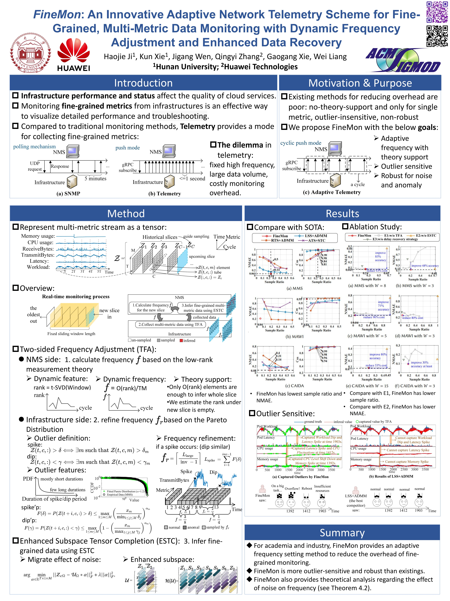
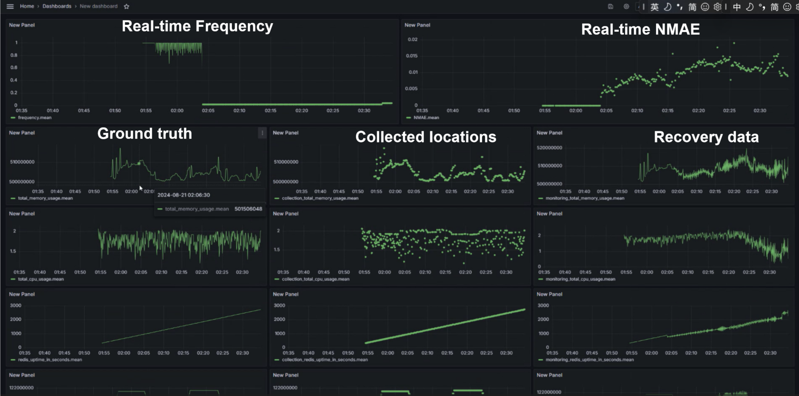
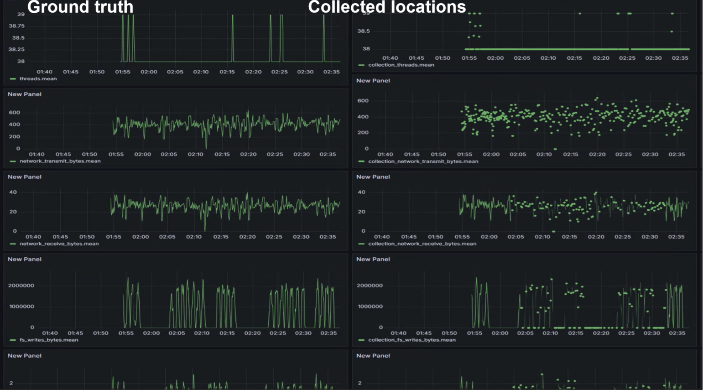
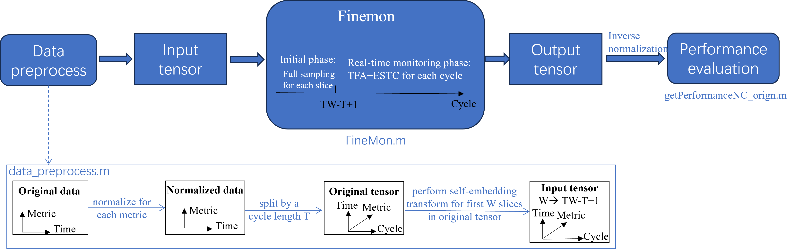

# FineMon
### Introduction：😊

FineMon is an fine-grained multi-metric data monitoring scheme with adaptive frequencies, and this work was carried out in response to **<u>*Huawei*</u>**'s needs ✊. FineMon has accepted by **<u>SIGMOD 2024</u>** ✌. This is a description of our monitoring scheme-FineMon. 

What FineMon can do？💪💪💪 

​	-FineMon can monitor accurately fined-grained multi-metric data with low overhead since FineMon provides the adaptive frequency adjustment method. FineMon provides a theoretical study of the effect of the amount of noise on frequency.

​	-FineMon can capture the various extremes, such as spikes and dips, according to the data distribution.

​	-FineMon can recover missing data with cyclicity even though data hasn't inherent cyclicity, and FineMon solves the limited accuracy of traditional subspace tensor completion in network telemetry by exploiting fine temporal features (enhanced subspace).

The direct results of FineMon are illustrated as follows

### Poster：😄

***Cite my work** if it gives you intuition or helps your research work 👇👇👇:  **<^..^>***

Haojie Ji, Kun Xie, Jigang Wen, Qingyi Zhang, Gaogang Xie, and Wei Liang. 2024. FineMon: An Innovative Adaptive Network Telemetry Scheme for Fine-Grained, Multi-Metric Data Monitoring with Dynamic Frequency Adjustment and Enhanced Data Recovery. Proc. ACM Manag. Data 2, 1, Article 12 (February 2024), 26 pages. https://doi.org/10.1145/3639267

### Monitoring System Demo: 🤩

*Don't forget give me **Star☆☆☆**  👆👆👆  if you interest or like our system demo.   **<^..^>***

### Source File describetion: 😊

The code of FineMon is the MATLAB version.  The coding process is shown below figure:

We introduce each code file as follows:

1.data_proprocess.m:  Data preprocessing, where the original data is processed into an input tensor according to the flow in the Figure.

2.FineMon.m:  Main file, this file can perform FineMon for each dataset (input data) and calculate the evaluation criteria (NMAE, Cos, Sample Ratio).

3.getPerformanceNC_orign.m: Calculate all the data's NMAE and Cos.

4.subroutine_residual.m: Calculate the residual(.) mensioned in equation (3).

5.subroutine_sw_removeFromW.m: Update the active window by removing the oldest slice, calculate the common window's rank, and estimate the active window's rank by the upper bound in the Theorem 4.1.

6.subroutine_sw_STupdateU.m: Perform self-embedding transform for full sampling slices, this is proposed in Section 4.3.1

7.subroutine_delayRecovery.m: The delay-recovery strategy mentioned in Section 4.3.

8.subroutine_delayRecovery_all.m: Perform the delay-recovery strategy for all previous incompleted slices.

9.refineSampling.m: Perform a refined sampling process corresponding to line 8 and 19  in Algorithm 1.

10.library function:

teye.m:  an identity tensor

tinv.m: the inverse of tensor

tpinv.m: the pseudo inverse of tensor

tprod.m: the tensor product "*"

tran.m: the transpose of tensor

tsvd.m: the t-SVD decomposition

### Dataset: 😶

1.MMS: A server performance dataset, the original link is [QAZASDEDC/TopoMAD: A Spatio-Temporal Deep Learning Approach for Unsupervised Anomaly Detection in Cloud Systems (TNNLS) (github.com)](https://github.com/QAZASDEDC/TopoMAD).   The original data is OriginalData_MMS_mat. The input tensor processed by data_preprocess.m is InputTensor_MMS_T=40_W=8.mat.

2.AQI(removed in paper):  the original link is https://www.microsoft.com/en-us/research/uploads/prod/2016/02/Data-1.zip  The original data is OriginalData_AQI(precompletion_by_LRTC)_mat. The input tensor processed by data_preprocess.m is InputTensor_AQI_T=50_W=15.mat.

3.SR(removed in paper): Our traffic statistics telemetry data (company name withheld to comply with anonymity rules). The original data is OriginalData_SR.mat. The input tensor processed by data_preprocess.m is InputTensor_SR_T=50_W=15.mat.

4.CAIDA：traffic traces collected from CAIDA‘s equinix-nyc monitor on a commercial blackbone link. The CAIDA UCSD Anonymized Internet Traces - <dates used>
https://www.caida.org/catalog/datasets/passive_dataset

5.MAWI：traffic traces at the transit link of WIDE to the upstream ISP are collected at the samplepoint-F， in operation since 2006/08/24.  [Traffic Trace Info (wide.ad.jp)](http://mawi.wide.ad.jp/mawi/samplepoint-F/2006/200608241400.html)

